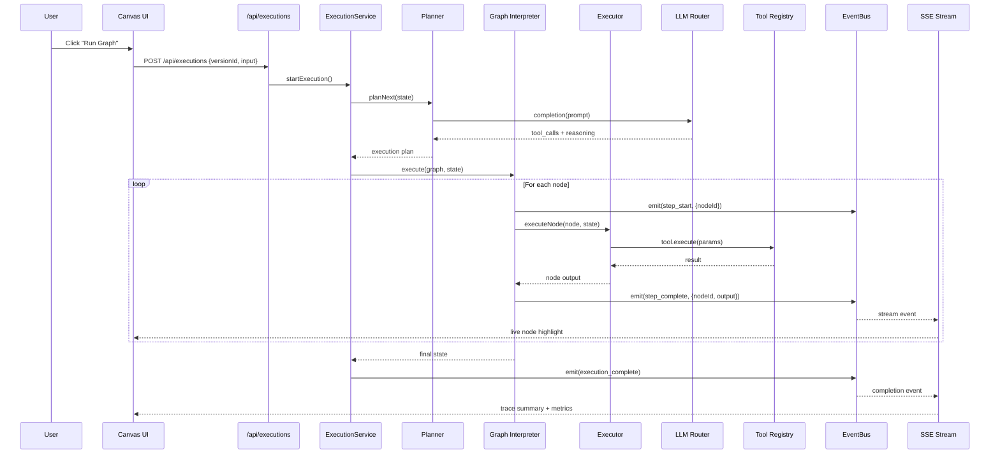
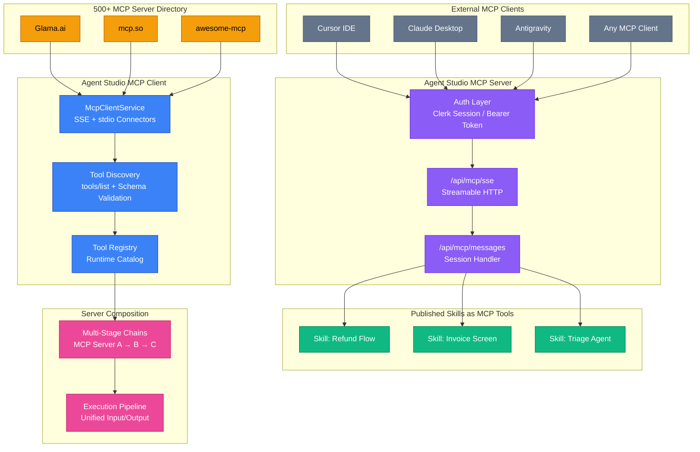

# Agent Studio — Visual Agent Canvas & Multi-Agent Orchestration Platform

[](https://agent-studio-v1.vercel.app/)
[](https://modelcontextprotocol.io)
[](https://neon.tech)
[](https://www.typescriptlang.org)
[](https://vitest.dev)
[](https://reactflow.dev)

> **Live Application**: [https://agent-studio-v1.vercel.app](https://agent-studio-v1.vercel.app)  
> **GitHub Repository**: [https://github.com/devhimanshuu/Agent-Studio](https://github.com/devhimanshuu/Agent-Studio)  

---

> **Enterprise-grade Visual AI Agent & Multi-Agent Orchestration Platform** where users can build complex agent graphs on an interactive node canvas, orchestrate multi-step workflows, convert and import Dify and n8n pipelines, manage schema-validated AI skills with immutable versioning, connect and discover **Model Context Protocol (MCP)** tools, execute under strict tool permissions and Human-in-the-Loop (HITL) approval guardrails, and stream live execution telemetry via Server-Sent Events (SSE).

---

## Overview

Agent Studio is a production-grade **Visual AI Agent Platform** combining the visual graph architecture of LangGraph Studio, the enterprise control of LangSmith, and the modularity of the Model Context Protocol (MCP) built on Next.js 15 and React Flow.

Users can visually design **Multi-Agent Graphs**, orchestrate **Chained Workflows**, import **Dify YAML** and **n8n JSON** workflows via AST converters, connect to **Model Context Protocol (MCP)** servers from a public directory of 500+ servers, configure **Reusable Skills**, version them like software, chain them into **Skill Chains**, build **Server Compositions**, track **Live Model Pricing** from OpenRouter and Groq, monitor **Health Dashboards**, and execute on an autonomous **Graph Interpreter Runtime (v2)** with real-time SSE streaming, permission validation, circuit-breaker LLM routing, and HITL approval gates.

```
+-----------------------------------------------------------------------------------------+
|                                   AGENT STUDIO LIFECYCLE                                |
|                                                                                         |
|  [ Visual Canvas Builder ] ---> [ Graph Validation & Diff ] ---> [ Immutable Versioning ]|
|             |                                                                |          |
|             v                                                                v          |
|  [ Multi-Step Workflows ]  ---> [ Live SSE Execution Engine ] <--- [ Skills & MCP Tool Hub ]|
|             |                               |                                           |
|             v                               v                                           |
|  [ Human Review (HITL) ]   ---> [ History, Trace & Metrics ] ---> [ Audit Logs & Replay ]|
+-----------------------------------------------------------------------------------------+
```

---

## Core Capabilities

### 1. Visual Agent Graph Builder & Canvas (`/dashboard/canvas`)
- **Interactive Drag-and-Drop Canvas**: Build complex agent graphs visually powered by `@xyflow/react`.
- **10 Distinct Node Types**:
  - `start` / `end`: Input entry and final payload emission terminals.
  - `agent`: Autonomous LLM node with role-specific system prompts and scoped tool allowances.
  - `supervisor`: Orchestrator node that directs tasks and chooses specialized specialist routes.
  - `tool`: Explicit tool execution step with parameterized template mappings (`{{ results.<nodeId>.<path> }}`).
  - `router`: Deterministic conditional branching or AI-driven routing based on dynamic state evaluation.
  - `approval`: Human-in-the-Loop gate with optional auto-approval conditions and escalation timeouts.
  - `loop`: Bounded iteration node with configurable `maxIterations` for retry or refinement loops.
  - `parallel`: Map-reduce node for parallel fan-out over collection items (`input.lineItems`).
  - `subgraph` (Macro): Encapsulated nested agent graph with boundary input/output variable mappings.
- **Hierarchical Auto-Layout**: Dagre-powered algorithmic auto-layout with a single click.
- **Real-Time Graph Validation**: Immediate visual feedback for cycles, disconnected islands, unreachable terminals, unconfigured tools, and invalid router expressions.
- **Visual Graph Diff**: Compare modified graphs side-by-side highlighting added, removed, and modified nodes/edges.
- **Interactive Pre-built Templates**:
  - *Supervisor -> Researcher -> Coder -> Critic* (Full Multi-Agent Loop)
  - *Map-Reduce Invoice Screening* (Parallel Fan-Out / Loop)
  - *HITL-Gated Disbursement* (Approval Gate / Conditional)
- **Instant Snapshots & Replay**: Save visual canvas state and inspect past execution snapshots.

### 2. Graph Interpreter Runtime (v2 Engine)
- **Deterministic State Machine**: Executes visual agent graphs node-by-node with strongly typed transitions, execution contexts, and step-level persistence.
- **Safe Expression Evaluator (`expression.ts`)**: Evaluates JSONPath queries, logical comparisons (`==`, `!=`, `>`, `<`, `contains`, `in`), and nested property access safely without `eval()`.
- **Real-Time EventBus Telemetry**: Emits granular lifecycle events (`step_start`, `step_complete`, `tool_call`, `paused_for_approval`, `stream_chunk`) streamed directly to clients over SSE.
- **Live Canvas Execution Preview**: Test and debug agent graphs directly inside the studio canvas with live node highlights and step logs.

### 3. Multi-Step Workflows Pipeline & AST Converters (`/dashboard/workflows`)
- **Chained Workflow Orchestration**: Build bounded, sequential business pipelines combining document retrieval, AI extraction, deterministic conditions, and action dispatchers.
- **Dify DSL AST Converter**: Converts Dify workflow YAML/JSON specifications into executable studio agent graphs with automatic node mapping for LLMs, code, tools, and template transforms.
- **n8n Workflow AST Converter**: Ingests and converts n8n workflow export JSON into valid studio graphs with automatic entry/exit terminal normalization.
- **Curated Production Workflow Templates**:
  - *Customer Refund Automation* (Finance / HITL-Gated)
  - *Invoice Compliance & Risk Screening* (Compliance / Automated Audit)
  - *Support Ticket Intent Triage & Escalation* (Support / Knowledge Search)
- **Visual Step Chain**: Interactive horizontal stepper showing data flow, required tools, and approval checkpoints.

### 4. Dynamic User-Defined Skills & Versioning (`/dashboard/skills`)
- **Schema-Validated AI Capabilities**: Define skills with Zod-validated input/output schemas, max execution step limits, and structured examples.
- **Immutable Versioning**: Published versions are frozen and immutable (`DRAFT -> PUBLISHED -> ARCHIVED`).
- **Automatic Draft Rotation**: Editing a published skill automatically branches into a new incremental draft.
- **Side-by-Side Version Diff (`/dashboard/compare`)**: Compare prompt instructions, schemas, tool permissions, and parameters between any two versions.

### 5. Human-in-the-Loop (HITL) Review Queue (`/dashboard/review`)
- **Safe Write-Action Guardrails**: Write-level tools (e.g. task creation, disbursements) pause execution into `PAUSED_FOR_APPROVAL`.
- **Single-Use Idempotency**: Atomic response handling prevents duplicate approvals or replay races.
- **Granular Controls**: Review detailed arguments, planner reasoning, and approve, reject, or cancel requests.

### 6. Observability, Execution History & Audit (`/dashboard/history` & `/dashboard/audit`)
- **Step-by-Step Execution Traces (`/dashboard/executions/[id]`)**: Detailed trace timeline with planner output, tool inputs/outputs, model metrics, execution duration, and structured logs.
- **One-Click Replay & Retry**: Re-execute past runs or retry failed steps with identical or updated parameters.
- **Enterprise Audit Trail**: Immutable audit logs capturing all skill mutations, approvals, and executions with full JSON export.

### 7. Resilient LLM Router with Live Pricing (`/dashboard/settings`)
- **Real-Time Dynamic Pricing**: Live token-based prompt and completion pricing directly fetched from OpenRouter and Groq APIs per 1M tokens.
- **Vendor-Agnostic Routing**: Unified `LLMProvider` abstraction routing across Groq and OpenRouter models.
- **Circuit-Breaker Failover**: Automatically recovers from rate limits (429), 5xx server errors, decommissioned models (404), or auth errors without failing user runs.
- **Adaptive Cooldowns**: Temporarily parks failing models and automatically reinstates them once healthy.
- **Clean Model Management**: Collapsible model rosters with instant search, category filtering (general, reasoning, code, vision, audio, safety), and exact official provider vector logos.

### 8. Model Context Protocol (MCP) Ecosystem
- **MCP Client Hub (`/dashboard/tools?tab=mcp`)**: Connect remote **SSE / Streamable HTTP** endpoints and local **stdio** MCP servers, auto-discover their `tools/list` definitions, validate schemas, and register them as first-class tools inside the LangGraph runtime.
- **1-Click Ecosystem Presets**: GitHub, Postgres, SQLite, Web Fetch, Brave Search, and Filesystem presets with connection configuration modals.
- **Live Tool Testing**: Inspect discovered JSON schemas and execute test payloads straight from the hub.
- **Agent Studio as an MCP Server**: External agents (Cursor, Claude Desktop, Antigravity) connect to `/api/mcp/sse` (Streamable HTTP + SSE) and access published workflows as callable tools. Auth via Clerk session or `MCP_ACCESS_TOKEN` bearer token.
- **500+ Public MCP Server Directory**: Browse servers from Glama.ai, mcp.so, and awesome-mcp-servers with 40+ categories, language filters, health ping, and quality scoring.
- **MCP Server Composition & Chaining**: Visually chain multiple MCP servers into unified multi-stage execution pipelines.

### 9. OpenAPI & REST API Integration (`/dashboard/tools?tab=openapi`)
- **Public OpenAPI Directory**: Browse and 1-click import from **2,500+ APIs** powered by the APIs.guru registry.
- **1-Click Tool Pack Presets**: Pre-configured REST API tool packs (Forex Rates, Weather, Wikipedia, NASA, Exchange Rates, GitHub Metadata, OpenAI, StackExchange).
- **Custom OpenAPI Spec Import**: Paste any Swagger/OpenAPI URL (JSON or YAML) to auto-parse, introspect endpoints, and mount them as callable agent tools.
- **Per-Endpoint Configuration**: Enable/disable individual endpoints, configure custom headers, and assign HITL approval gates on write operations.

### 10. Visual Workflow Builder Enhancements
- **Marketplace Drag-and-Drop Panel**: Pre-built workflow templates (Research Agent, Intent Classifier, HITL Approval Pipeline, RSS Monitor, Document Processor, Parallel Map-Reduce, Voice Pipeline, Iterative Refinement Loop) that can be searched, filtered by category, and dragged directly onto the canvas as complete node groups.
- **Conditional Branching UI**: Visual branch editor for Router and Supervisor nodes with mode toggle between Deterministic (condition expression) and AI (LLM prompt) routing. Per-branch condition expressions with visual preview.
- **Parallel Execution Visualization**: Animated progress bar showing completion across parallel branches with per-branch status chips (running/success/failed), ghost placeholders for pending branches, and duration display.
- **Real-Time Execution Progress Overlay**: Floating overlay during live trace mode with progress bar, status breakdown grid (Running/Success/Failed/Waiting), active node details, HITL approval details, token summary, and live elapsed timer.
- **Enhanced Version Diff Visualization**: Visual diff mode with color-coded node cards (green=added, red=removed, amber=changed), edge diff cards with status badges, list/visual toggle, and summary statistics bar.

### 11. Execution Timeline Sidebar
- **Vertical Chronological Timeline**: Processes live `ExecutionEvent` stream into structured step cards on a vertical connector line with colored status indicators (running=indigo pulse, success=green, failed=red, awaiting=amber, skipped=gray).
- **Expandable Detail Panels**: Click any step to reveal output/errors, precise timestamps, and a sub-event timeline with type-specific icons for tool calls (cyan), LLM calls with token counts (violet), MCP calls (fuchsia), router decisions (amber), loop iterations (fuchsia), parallel branches (teal), approval gates (amber/green), and A2A delegations (purple).
- **Search & Filter Controls**: Full-text search across node labels, IDs, types, and sub-events. Filter chips for status (RUNNING/SUCCESS/FAILED/AWAITING/SKIPPED) and node type dropdown.
- **Timeline Export**: Export as structured JSON trace (with full metadata, ISO timestamps, sub-events) or formatted Markdown report (status emoji, step tables, horizontal rules).
- **Canvas Focus & Pan/Zoom**: "Focus on canvas" button smoothly pans and zooms the viewport to center on the target node with a 2-second amber pulse highlight ring.
- **Auto-scroll with Smart Pausing**: Follows latest events by default, but pauses auto-scroll when filters are active.

### 12. Advanced RAG Features (`/modules/rag/`)
- **Multi-Modal RAG Processor**: Extracts and embeds tables (markdown/CSV detection, structured `{headers, rows}` representation), code blocks (language detection, function/class boundary splitting, signature extraction), and images (alt-text + surrounding context) alongside standard text chunks.
- **Graph-Based Knowledge Graph**: Pattern-based NER for 8 entity types (person, organization, technology, concept, location, document, method, metric), sliding-window co-occurrence relationship extraction, degree centrality computation, label-propagation community detection, BFS graph traversal, and entity-centric search with centrality boosting.
- **Automatic Chunk Size Optimization**: Statistical analysis of chunk size distributions (mean, median, P90, P95, P99, variance), optimal boundary detection via F1-score against target range, quality scoring (completeness, overlap, token density), and adaptive recommendations.
- **Cross-Collection Search**: Federated retrieval across multiple RAG collections with configurable per-collection score boosts, Maximal Marginal Relevance (MMR) diversity re-ranking, collection-aware analytics, and auto-discovery of available collections.
- **Comprehensive RAG Evaluation Pipeline**: Extends RAG Triad with Context Precision, Context Recall, Faithfulness (sentence-level claim verification), Answer Relevance, Hallucination Detection (per-sentence with risk rating), Retrieval Quality (Precision@k, MRR), Per-Chunk Quality scoring, and aggregated Grade Assessment with configurable LLM judge and heuristic fallback.
- **Condition Expression Editor**: Rich editor with syntax highlighting (12 token kinds), real-time autocomplete for state references (`results.*`, `input.*`, `item.*`), graph-aware node ID completion, operator suggestions, and real-time validation (unterminated strings, unbalanced parentheses, unknown references, missing operators).

---

## Architecture

```
Agent Studio
|-- Presentation Layer (Next.js 15 App Router, React 19, Vanilla CSS & Glassmorphism, XYFlow, Zustand, TanStack Query)
|   |-- /dashboard/canvas       -> Visual Graph Builder, Node Palette, Auto Layout, Snapshot & Diff
|   |-- /dashboard/workflows    -> Multi-Step Workflow Pipeline & AST Import Steppers
|   |-- /dashboard/skills       -> Schema-driven Skill CRUD, Version History & Compare
|   |-- /dashboard/executions   -> Execution Trace Timeline, Replay Engine & Metrics
|   |-- /dashboard/review       -> HITL Approval Queue with Idempotency Gates
|   `-- /api/                   -> REST & SSE Streaming Handlers
|
|-- Application & Domain Layer (Clean Architecture Services & Modules)
|   |-- modules/graph/          -> Graph Interpreter, Safe Expression Evaluator, EventBus, PreviewStore
|   |-- modules/execution/      -> Graph Nodes, Planner, Execution Engine, Agent State
|   |-- modules/approval/       -> HITL Approval Engine & Policy Rules
|   |-- modules/tools/          -> Tool Registry & Builtin Tool Implementations
|   |-- modules/openapi/        -> OpenAPI Parser, Presets, Spec Validator
|   |-- modules/rag/            -> Multi-Modal Processor, Knowledge Graph, Chunk Optimizer, Cross-Collection Search, Eval Pipeline
|   |-- lib/converters/         -> Dify YAML & n8n JSON AST Converters
|   `-- services/               -> ExecutionService, SkillService, ApprovalService, VersionService, OpenApiService
|
`-- Infrastructure Layer (Prisma ORM, Neon PostgreSQL, Clerk Auth, Pino, LLM Router)
    |-- providers/llm/          -> GroqProvider, OpenRouterProvider, Resilient LLMRouter, Live Pricing
    |-- repositories/           -> Prisma Repositories with Dependency Inversion Interfaces
    `-- lib/                    -> Structured Logging (Pino), Rate Limiter, Env Validation (Zod)
```

### System Architecture Diagram

```mermaid
graph TB
    subgraph Presentation["Presentation Layer"]
        direction LR
        Canvas["Canvas Builder<br/>React Flow + XYFlow + Dagre"]
        SkillsUI["Skills Studio<br/>CRUD + Versions + Compare"]
        ExecUI["Execution History<br/>Traces + Replay + Metrics"]
        ReviewUI["HITL Review Queue<br/>Approval Gates"]
        MCPUI["MCP Hub<br/>500+ Servers + Directory"]
        OpenAPIUI["OpenAPI Hub<br/>2500+ APIs"]
    end

    subgraph API["API Layer — Next.js Route Handlers"]
        direction LR
        SkillsAPI["/api/skills<br/>CRUD + Publish + RBAC"]
        ExecAPI["/api/executions<br/>Start + Replay + SSE Stream"]
        CanvasAPI["/api/canvas/preview<br/>Live Ghost Preview"]
        MCPAPI["/api/mcp<br/>Client + Server + Directory"]
        OrgAPI["/api/organizations<br/>Members + Roles + Audit"]
        ApprovAPI["/api/approvals<br/>HITL Queue"]
    end

    subgraph Services["Service Layer — Business Logic"]
        direction LR
        SkillSvc["SkillService<br/>Versioning + Diff"]
        ExecSvc["ExecutionService<br/>Orchestration"]
        RBACSvc["RBACService<br/>Org + Custom Roles"]
        OrgSvc["OrganizationService<br/>Multi-Tenancy"]
        ApprovSvc["ApprovalService<br/>Idempotency Gates"]
        AuditSvc["AuditService<br/>Immutable Logs"]
        PlanSvc["PlanLimitsService<br/>Usage Quotas"]
        McpSvc["McpClientService<br/>SSE + Streamable HTTP"]
        OpenApiSvc["OpenApiService<br/>Spec Parsing"]
    end

    subgraph Modules["Core Runtime Modules"]
        direction LR
        subgraph GraphMod["Graph Engine"]
            GI["Graph Interpreter<br/>State Machine v2"]
            EE["Expression Evaluator<br/>Safe JSONPath"]
            EB["EventBus<br/>SSE Telemetry"]
            PS["PreviewStore<br/>Ghost Dry-Run"]
        end

        subgraph ExecMod["Execution Engine"]
            PL["Planner<br/>LLM + Rule Routing"]
            EX["Executor<br/>Step Runner"]
            AS["Agent State<br/>Typed Transitions"]
        end

        subgraph RAGMod["RAG Pipeline"]
            MMP["Multi-Modal<br/>Tables + Code + Images"]
            KG["Knowledge Graph<br/>NER + Relationships"]
            CO["Chunk Optimizer<br/>F1 Boundary Detection"]
            CCS["Cross-Collection<br/>MMR Diversity Re-ranking"]
            RAGP["Eval Pipeline<br/>10+ Metrics + Hallucination"]
        end

        subgraph MCPMod["MCP Ecosystem"]
            MCPClient["MCP Client<br/>SSE + stdio Connectors"]
            MCPServer["MCP Server<br/>/api/mcp/sse Endpoint"]
            MCPDir["MCP Directory<br/>500+ Presets"]
            MCPComp["Server Composition<br/>Multi-Stage Chains"]
        end

        subgraph ToolMod["Tool Registry"]
            TR["8 Builtin Tools<br/>Calculator + AI + Search"]
            OAPI["OpenAPI Parser<br/>Swagger + Presets"]
        end

        subgraph ApprovalMod["Approval Engine"]
            AE["Approval Engine<br/>Policy Rules"]
            HITL["HITL Gates<br/>Auto-Approval + Timeout"]
        end
    end

    subgraph Infra["Infrastructure Layer"]
        direction LR
        Prisma["Prisma ORM<br/>Neon PostgreSQL"]
        Clerk["Clerk Auth<br/>Sessions + Orgs"]
        LLMRouter["LLM Router<br/>Groq + OpenRouter<br/>Circuit Breaker + Live Pricing"]
        Pino["Pino Logger<br/>Structured JSON"]
        Vault["Vault Service<br/>Encrypted Secrets"]
    end

    %% ── Presentation → API ──
    Canvas --> CanvasAPI
    SkillsUI --> SkillsAPI
    ExecUI --> ExecAPI
    ReviewUI --> ApprovAPI
    MCPUI --> MCPAPI
    OpenAPIUI --> MCPAPI

    %% ── API → Services ──
    SkillsAPI --> SkillSvc
    SkillsAPI --> RBACSvc
    ExecAPI --> ExecSvc
    CanvasAPI --> ExecSvc
    OrgAPI --> OrgSvc
    OrgAPI --> RBACSvc
    ApprovAPI --> ApprovSvc
    MCPAPI --> McpSvc

    %% ── Services → Modules ──
    SkillSvc --> Prisma
    ExecSvc --> GI
    ExecSvc --> PL
    ExecSvc --> EX
    ExecSvc --> EB
    RBACSvc --> Prisma
    OrgSvc --> Prisma
    ApprovSvc --> AE
    McpSvc --> MCPClient
    OpenApiSvc --> OAPI

    %% ── Module dependencies ──
    GI --> EE
    GI --> EB
    PL --> LLMRouter
    EX --> TR
    EX --> AE
    TR --> MCPClient
    MMP --> Prisma
    KG --> Prisma
    CO --> MMP
    CCS --> Prisma
    RAGP --> LLMRouter
    MCPServer --> McpSvc
    MCPComp --> MCPClient

    %% ── All → Infra ──
    SkillSvc --> Clerk
    OrgSvc --> Clerk
    ExecSvc --> Pino
    GI --> Pino
    LLMRouter --> Pino

    classDef presentation fill:#3b82f6,stroke:#1e40af,color:#fff
    classDef api fill:#8b5cf6,stroke:#6d28d9,color:#fff
    classDef service fill:#10b981,stroke:#047857,color:#fff
    classDef module fill:#f59e0b,stroke:#b45309,color:#000
    classDef infra fill:#6b7280,stroke:#374151,color:#fff

    class Canvas,SkillsUI,ExecUI,ReviewUI,MCPUI,OpenAPIUI presentation
    class SkillsAPI,ExecAPI,CanvasAPI,MCPAPI,OrgAPI,ApprovAPI api
    class SkillSvc,ExecSvc,RBACSvc,OrgSvc,ApprovSvc,AuditSvc,PlanSvc,McpSvc,OpenApiSvc service
    class GI,EE,EB,PS,PL,EX,AS,MMP,KG,CO,CCS,RAGP,MCPClient,MCPServer,MCPDir,MCPComp,TR,OAPI,AE,HITL module
    class Prisma,Clerk,LLMRouter,Pino,Vault infra
```



### Data Flow — Canvas Execution Pipeline



### Data Flow — RAG Pipeline Integration

```mermaid
graph LR
    subgraph Input["Document Ingestion"]
        DOC["Raw Document<br/>PDF, MD, HTML"]
    end

    subgraph Processing["Multi-Modal Processing"]
        MMP["Multi-Modal<br/>Processor"]
        TAB["Table Extractor<br/>MD/CSV → structured"]
        CODE["Code Extractor<br/>Lang detect + split"]
        IMG["Image Extractor<br/>Alt-text + context"]
    end

    subgraph Chunking["Intelligent Chunking"]
        CS["Chunking Service<br/>Overlapping windows"]
        CO["Chunk Optimizer<br/>F1 boundary detection"]
    end

    subgraph Embedding["Embedding Pipeline"]
        ES["Embedding Service<br/>Vector generation"]
        PG["pgvector Store<br/>Hybrid dense+sparse"]
    end

    subgraph Enrichment["Knowledge Enrichment"]
        KG["Knowledge Graph<br/>NER + Relationships"]
        CL["Cluster Visualizer<br/>t-SNE / UMAP"]
    end

    subgraph Retrieval["Query & Retrieval"]
        QR["Query Router<br/>Hybrid search"]
        RR["Reranker<br/>Cross-encoder"]
        CCS["Cross-Collection<br/>Federated + MMR"]
    end

    subgraph Eval["Evaluation"]
        RAGP["Eval Pipeline<br/>10+ metrics"]
        HALL["Hallucination<br/>Detection"]
        GRADE["Grade Assessment<br/>LLM Judge + Heuristic"]
    end

    DOC --> MMP
    MMP --> TAB
    MMP --> CODE
    MMP --> IMG
    TAB --> CS
    CODE --> CS
    IMG --> CS
    CS --> CO
    CO --> ES
    ES --> PG
    PG --> KG
    KG --> CL
    PG --> QR
    QR --> RR
    RR --> CCS
    CCS --> RAGP
    RAGP --> HALL
    RAGP --> GRADE

    classDef input fill:#ef4444,stroke:#b91c1c,color:#fff
    classDef process fill:#f59e0b,stroke:#b45309,color:#000
    classDef store fill:#3b82f6,stroke:#1e40af,color:#fff
    classDef enrich fill:#8b5cf6,stroke:#6d28d9,color:#fff
    classDef retrieve fill:#10b981,stroke:#047857,color:#fff
    classDef eval fill:#ec4899,stroke:#be185d,color:#fff

    class DOC input
    class MMP,TAB,CODE,IMG,CS,CO process
    class ES,PG store
    class KG,CL enrich
    class QR,RR,CCS retrieve
    class RAGP,HALL,GRADE eval
```



### MCP Ecosystem Data Flow



---

## Tool Registry

Every tool implements the unified `ITool` contract (`id`, `name`, `description`, `category`, `inputSchema`, `outputSchema`, `requiresApproval`, `execute()`, `validate()`, `healthCheck()`) and self-registers into the runtime catalog:

| Tool ID | Category | Type | Approval Required | Description |
|---|---|---|:---:|---|
| `calculator` | `COMPUTE` | READ | No | Safe mathematical expression evaluation |
| `document_search` | `SEARCH` | READ | No | Keyword and semantic search across knowledge base docs |
| `record_lookup` | `DATA` | READ | No | Structured CRM / entity record retrieval |
| `ai_extraction` | `AI` | READ | No | LLM-powered structured parameter extraction from unstructured text |
| `ai_classification` | `AI` | READ | No | Intent and risk category classification |
| `deterministic_condition` | `LOGIC` | READ | No | Precise threshold and rule verification against business criteria |
| `final_report` | `SYNTHESIS` | READ | No | Executive summary and structured audit report compilation |
| `mock_task_creator` | `TASK` | WRITE | Yes | Action dispatcher (creates external tasks / disbursements with HITL signoff) |

---

## Tech Stack

- **Framework**: [Next.js 15](https://nextjs.org/) (App Router, Server Components & Route Handlers), [React 19](https://react.dev/)
- **Visual Graph & Canvas**: [@xyflow/react (React Flow)](https://reactflow.dev/), [Dagre](https://github.com/dagrejs/dagre) (hierarchical graph layout)
- **Language & Validation**: [TypeScript 5](https://www.typescriptlang.org/) (Strict Mode), [Zod](https://zod.dev/)
- **Styling & UI**: [TailwindCSS](https://tailwindcss.com/), [Lucide React](https://lucide.dev/), Custom Glassmorphic Dark/Light Design System
- **State Management**: [TanStack Query v5](https://tanstack.com/query), [Zustand](https://zustand-demo.pmnd.rs/), [React Hook Form](https://react-hook-form.com/)
- **Database & ORM**: [Neon PostgreSQL](https://neon.tech/), [Prisma ORM](https://www.prisma.io/)
- **Authentication**: [Clerk](https://clerk.com/)
- **AI & LLM Routing**: [Groq SDK](https://groq.com/), [OpenRouter API](https://openrouter.ai/) with custom circuit-breaker failover router
- **Streaming & Real-Time**: Server-Sent Events (SSE) via native Web Streams API
- **Observability & Logging**: [Pino](https://getpino.io/) structured JSON logger
- **Testing**: [Vitest](https://vitest.dev/) (70 test suites, 559 tests), [Playwright](https://playwright.dev/) (E2E Smoke)

---

## Repository Structure

```
├── prisma/
│   ├── schema.prisma                  # PostgreSQL schema (Skills, Versions, Executions, Approvals, Audit)
│   └── seed.ts                        # Idempotent demo workspace seed script
├── src/
│   ├── app/
│   │   ├── api/
│   │   │   ├── skills/                # CRUD, publish, archive, duplicate endpoints
│   │   │   ├── executions/            # Execution start, replay, cancel, resume, SSE stream
│   │   │   ├── canvas/preview/        # Live canvas preview & SSE streaming endpoint
│   │   │   ├── approvals/             # Review queue & idempotent approval responses
│   │   │   ├── audit/                 # Audit trail querying & JSON export
│   │   │   ├── tools/                 # Tool catalog & health status
│   │   │   ├── models/                # Dynamic provider models & live pricing API
│   │   │   ├── workflows/             # Dify & n8n search and conversion endpoints
│   │   │   ├── settings/              # Provider status & telemetry settings
│   │   │   ├── health/                # Public health probe endpoint
│   │   │   ├── openapi/               # OpenAPI spec parsing, directory & integration endpoints
│   │   │   └── mcp/                   # MCP Server, client, directory & composition endpoints
│   │   ├── dashboard/
│   │   │   ├── canvas/                # Visual Graph Builder ([id], /new, /[id]/snapshot)
│   │   │   ├── workflows/             # Multi-step Workflow Pipelines & Import Steppers
│   │   │   ├── skills/                # Skills Registry, Editor, Versions & Marketplaces
│   │   │   ├── executions/            # Execution History & Trace Detail ([id])
│   │   │   ├── review/                # Human-in-the-Loop Review Queue
│   │   │   ├── history/               # Platform Observability & Success Metrics
│   │   │   ├── compare/               # Side-by-side Skill & Graph Diffing
│   │   │   ├── audit/                 # Security Audit Trail
│   │   │   ├── tools/                 # Tool Registry Browser + MCP Hub + OpenAPI Hub
│   │   │   └── settings/              # Provider Models, API Keys & Live Pricing
│   │   ├── page.tsx                   # Landing page with interactive Live Agent Canvas Demo
│   │   └── layout.tsx                 # Root layout with Clerk, Theme, and Sidebar providers
│   ├── components/
│   │   ├── canvas/                    # AgentGraphCanvas, CanvasNodes, NodeInspector, AutoLayout, Diff
│   │   │   ├── AgentGraphCanvas.tsx   # Main canvas with fullscreen/normal layouts, pan/zoom, highlight
│   │   │   ├── MarketplacePanel.tsx   # Drag-and-drop workflow templates marketplace
│   │   │   ├── ConditionalBranchEditor.tsx # Visual branch editor for router/supervisor nodes
│   │   │   ├── ConditionExpressionEditor.tsx # Syntax-highlighted expression editor with autocomplete
│   │   │   ├── ExecutionProgressOverlay.tsx # Real-time execution progress floating overlay
│   │   │   ├── ExecutionTimeline.tsx  # Vertical timeline sidebar with search, filter, export
│   │   │   ├── ParallelBranchProgress.tsx # Parallel branch progress visualization
│   │   │   └── GraphDiffModal.tsx     # Visual diff modal with color-coded node/edge cards
│   │   ├── workflows/                 # WorkflowForm, WorkflowCard, WorkflowStepChain, Templates
│   │   ├── common/                    # BrandLogos (exact SVG vectors for OpenRouter & Groq)
│   │   ├── landing/                   # LiveAgentCanvasDemo playground
│   │   ├── skills/                    # SkillForm, StatusBadge, VersionList, Marketplaces
│   │   ├── executions/                # ExecutionTimeline, ExecutionStatusBadge
│   │   └── feedback/                  # Toaster, ConfirmDialog, Skeleton Library, ErrorBoundary
│   ├── modules/
│   │   ├── graph/                     # GraphInterpreter, Expression Evaluator, EventBus, PreviewStore
│   │   ├── execution/                 # Graph nodes, Planner, Executor, State definitions
│   │   ├── approval/                  # ApprovalEngine, Idempotency validators
│   │   ├── history/                   # ExecutionHistoryService
│   │   ├── mcp/                       # MCP protocol, client service, presets, server implementation
│   │   ├── openapi/                   # OpenAPI parser, presets, spec validation
│   │   ├── rag/                       # RAG pipeline modules (see below)
│   │   │   ├── multiModalProcessor.ts # Table, code, image chunk extraction
│   │   │   ├── knowledgeGraph.ts      # Entity extraction, relationship mapping, community detection
│   │   │   ├── chunkOptimizer.ts      # Chunk size analysis, boundary optimization, quality scoring
│   │   │   ├── crossCollectionSearch.ts # Federated cross-collection search with MMR re-ranking
│   │   │   ├── ragEvalPipeline.ts     # Comprehensive RAG evaluation (10+ metrics)
│   │   │   ├── chunkingService.ts     # Text chunking & overlap strategies
│   │   │   ├── embeddingService.ts    # Embedding generation & batching
│   │   │   ├── evaluation.ts          # RAG triad evaluation (context, faithfulness, relevance)
│   │   │   ├── pgvectorStore.ts       # pgvector storage, search, and hybrid retrieval
│   │   │   ├── reranker.ts            # Cross-encoder reranking
│   │   │   └── clusterVisualizer.ts   # t-SNE/UMAP cluster visualization
│   │   └── tools/                     # Tool Registry + 8 Builtin Tool Implementations
│   ├── providers/llm/                 # LLMProvider, GroqProvider, OpenRouterProvider, LLMRouter, Live Pricing
│   ├── repositories/                  # Prisma data repositories (+ Dependency Inversion interfaces)
│   ├── services/                      # SkillService, ExecutionService, ApprovalService, VersionService, OpenApiService
│   ├── lib/
│   │   ├── converters/                # Dify YAML & n8n JSON AST Workflow Converters
│   │   ├── utils/pricing.ts           # Dynamic token pricing calculation & formatting utilities
│   │   ├── config/                    # Environment validation (Zod)
│   │   └── logger/                    # Structured logging (Pino)
│   └── validators/                    # Zod schemas for graphs, skills, executions, and requests
└── tests/
    └── unit/                          # Vitest unit suites (70 test files, 559 passing tests)
```

---

## Quickstart & Setup

### 1. Prerequisites
- **Node.js**: >= 18.18.0
- **PostgreSQL Database**: (e.g. [Neon](https://neon.tech/))
- **Clerk Account**: for authentication credentials

### 2. Environment Configuration

Copy the example environment file and configure credentials:

```bash
cp .env.example .env.local
```

| Variable | Required | Purpose |
|---|:---:|---|
| `DATABASE_URL` | Yes | PostgreSQL connection string |
| `NEXT_PUBLIC_CLERK_PUBLISHABLE_KEY` | Yes | Clerk public API key |
| `CLERK_SECRET_KEY` | Yes | Clerk secret key |
| `GROQ_API_KEY` | Optional | Groq API key for ultra-fast LLM execution |
| `OPENROUTER_API_KEY` | Optional | OpenRouter API key for multi-model fallback & live catalog |
| `NEXT_PUBLIC_APP_URL` | Optional | App URL for OpenRouter attribution headers |
| `MCP_ACCESS_TOKEN` | Optional | Bearer token external MCP clients use to connect to `/api/mcp/sse` |

### 3. Install & Initialize Database

```bash
npm install          # Automatically runs prisma generate via postinstall
npx prisma db push   # Synchronizes Prisma schema with your database
```

### 4. Optional: Seed Demo Workspace

Populate demo skills, multi-agent graphs, historical execution traces, and audit logs:

```bash
# Optional: bind demo records to your specific Clerk User ID
SEED_USER_ID=<your-clerk-user-id> npm run db:seed
```

### 5. Start Development Server

```bash
npm run dev
```

Open [http://localhost:3000](http://localhost:3000) in your browser.

---

## API & Streaming Endpoints

All endpoints require Clerk session authentication (except `/api/health` and bearer-authenticated MCP endpoints). Responses follow a standardized JSON envelope:

```jsonc
{
  "success": true,
  "data": { /* Result Payload */ }
}
```

### Core Endpoints

| Method | Endpoint | Description |
|---|---|---|
| `GET / POST` | `/api/skills` | List skills (search/filter/sort) or create a new skill |
| `GET / PATCH / DELETE` | `/api/skills/:id` | Retrieve, update draft, or delete a skill |
| `POST` | `/api/skills/:id/publish` | Publish current draft as an immutable version |
| `POST` | `/api/skills/:id/duplicate` | Duplicate an existing skill |
| `POST` | `/api/skills/:id/archive` | Archive a skill |
| `GET / POST` | `/api/executions` | List executions or trigger a new agent execution |
| `GET` | `/api/executions/:id/detail` | Get complete trace, planner steps, and tool logs |
| `GET` | `/api/executions/:id/stream` | **SSE Stream**: Real-time live execution progress & node events |
| `POST` | `/api/executions/:id/replay` | Replay execution with identical or modified inputs |
| `POST` | `/api/executions/:id/cancel` | Cancel an ongoing or paused execution |
| `POST` | `/api/executions/:id/resume` | Resume execution after human approval |
| `POST` | `/api/canvas/preview` | Initialize a live canvas preview execution |
| `GET` | `/api/canvas/preview/:id/stream` | **SSE Stream**: Live stream node-by-node canvas preview trace |
| `GET / POST` | `/api/approvals` | List pending approvals or submit an idempotent response |
| `GET` | `/api/audit` | Fetch searchable audit history with JSON export |
| `GET` | `/api/models` | Fetch real-time provider model catalog and live token pricing |
| `GET` | `/api/workflows/search` | Search integrated workflow marketplaces |
| `GET` | `/api/workflows/dify/:id` | Fetch and convert Dify workflow DSL to studio graph |
| `GET` | `/api/workflows/n8n/:id` | Fetch and convert n8n JSON workflow to studio graph |
| `GET` | `/api/health` | Public health probe and service status |
| `GET / POST` | `/api/mcp/servers` | List user's MCP servers or connect a new one |
| `POST` | `/api/mcp/servers/:id/connect` | Connect and discover tools from an MCP server |
| `POST` | `/api/mcp/servers/:id/discover` | Refresh cached tool definitions (`tools/list`) |
| `GET` | `/api/mcp/directory` | Public MCP directory (500+ servers from Glama, mcp.so, awesome-mcp) |
| `GET / POST` | `/api/mcp/sse` | **MCP Server**: external agents connect here (Streamable HTTP / SSE) |
| `POST` | `/api/mcp/messages` | **MCP Server**: message endpoint for active sessions |
| `GET` | `/api/openapi/directory` | Browse 2,500+ public APIs from APIs.guru registry |
| `GET / POST` | `/api/openapi/integrations` | List user's OpenAPI integrations or mount a new one |

---

## Testing & Verification

```bash
# Run unit & integration test suites
npm test

# Run linter and static analysis
npm run lint

# Run strict TypeScript type checks
npm run typecheck

# Run production build compilation
npm run build
```

**Verification Results:**
- **70 Test Suites Passed (559 / 559 Tests Passing)** with 100% success rate.
- **0 ESLint Errors & 0 Warnings** across all components, API routes, and modules.
- **0 TypeScript Type Errors** under strict compiler configuration.
- **Clean Next.js 15 Production Build** across all 64 pages and 70+ dynamic API endpoints.

---

## In Development Features

- **Multi-Tenant Organization Workspaces**: Role-Based Access Control (RBAC) supporting Owner, Admin, Developer, and Auditor roles with workspace-level isolation.
- **Community Skill & Graph Template Marketplace**: Public marketplace for publishing, discovering, rating, and 1-click cloning agent workflows and custom skill definitions.
- **Webhook & Notification Integrations**: Automated alert dispatching to Slack, Discord, and custom webhook endpoints for review queue approvals and failed executions.
- **Per-Node Token Analytics & Cost Attribution**: Real-time token usage telemetry and exact dollar cost tracking aggregated per canvas node and workflow step.

---

## Upcoming Features

- **Autonomous Agent-to-Agent (A2A) Negotiation Protocol**: Decentralized task auctioning and capability bidding enabling autonomous collaboration between specialized agent networks.
- **Federated MCP Network Gateway**: Zero-configuration local network discovery and peer-to-peer proxying for distributed MCP tools across clusters.
- **Automated Prompt & Graph Self-Refinement**: Continuous LLM Judge benchmark loops that automatically propose and validate graph structural optimizations.
- **Air-Gapped Local Model Runtime**: WebAssembly, Pyodide, and Ollama integration for fully offline agent execution without external API dependencies.
- **Distributed Checkpointing & State Persistence**: Redis-backed execution checkpointing with snapshot rewind and horizontal scalability across worker pools.

---

## 👨‍💻 Developer & Maintainer

```typescript
interface Developer {
  name: "Himanshu";
  github: "https://github.com/devhimanshuu";
  role: "Creator & Lead Architect";
  project: "Agent Studio";
  stack: ["Next.js 15", "TypeScript", "React Flow", "MCP", "Prisma", "PostgreSQL"];
  mission: "Architecting autonomous visual agent ecosystems and multi-agent workflows 🚀";
}
```

<p align="left">
  <b>Engineered with ❤️ & ☕ by <a href="https://github.com/devhimanshuu">Himanshu (@devhimanshuu)</a></b>
</p>

---

## License

This project is open-source software licensed under the **MIT License**.

